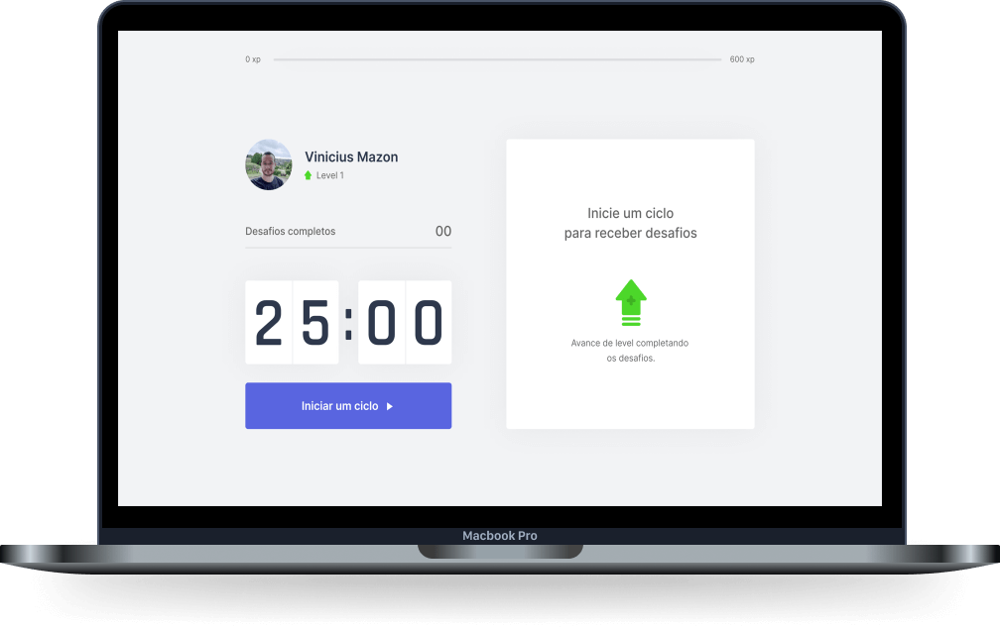

<h1 align="center">
  
</h1>
<p align="center">
  <a href="#-sobre-o-projeto">Sobre o projeto</a>&nbsp;&nbsp;&nbsp;|&nbsp;&nbsp;&nbsp;
  <a href="#-tecnologias">Construido utilizando</a>&nbsp;&nbsp;&nbsp;|&nbsp;&nbsp;&nbsp;
  <a href="#-como-utilizar">Como utilizar</a>&nbsp;&nbsp;&nbsp;|&nbsp;&nbsp;&nbsp;
  <a href="#-como-contribuir">Como contribuir</a>&nbsp;&nbsp;&nbsp;|&nbsp;&nbsp;&nbsp;
  <a href="#-licença">Licença</a>
</p>
<div align="center">
    <p>
        <a href="https://github.com/ViniciusMazon/nlw4-move-it/blob/main/LICENSE"></a>
   </p>
</div>


</br>

 <p align="center">
  
</p> 

</br>


# 💡 Sobre o projeto

Profissionais de tecnologia passam horas seguidas trabalhando em frente ao computador, o que a longo prazo pode ser prejudicial à saúde.O Move.it é um timer que em cada ciclo de 25 minutos te desafia a realizar alguma tarefa voltada a manutenção da saúde dos seus olhos e articulações.Utiliza a gamificação como metodologia a fim de incentivar e recompensar o usuário por cada tarefa realizada. Conforme mais tarefas são feitas, maior o seu level.

**Acesse a demo do [Move.it](https://move-it-mazon.vercel.app)**

**Assista ao [vídeo da demo](https://www.youtube.com/watch?v=1YbSeOYaveA&feature=youtu.be)**

</br>

Desenvolvido durante a NLW#4, créditos a [Rocketseat 🚀](https://github.com/Rocketseat)

</br>


# 🚀 Construido utilizando

- [TypeScript](https://www.typescriptlang.org)
- [ReactJS](https://reactjs.org)
- [NextJS](https://nextjs.org)
- [React Context](https://pt-br.reactjs.org/docs/context.html)
- [Commitizen](https://github.com/commitizen/cz-cli)
- [GitFlow](https://github.com/nvie/gitflow)

</br>

# ⚙️ Como utilizar

Clone o repositório:

```bash
git clone https://github.com/ViniciusMazon/nlw4-move-it.git
```

Instale as dependência rodando, individualmente em cada diretório (api, web e mobile), o comando:

```
yarn
```

Rode o projeto utilizando o script:

```
yarn dev
```

</br>

# 🖖🏻 Como contribuir

- Faça um fork desse repositório;
- Clone esse repositório em sua máquina: `https://github.com/ViniciusMazon/nlw4-move-it.git`
- Cria uma branch com a sua feature: `git checkout -b minha-feature`;
- Faça commit das suas alterações: `git commit -m 'feat: Minha nova feature'`;
- Faça push para a sua branch: `git push origin minha-feature`.

Depois que o merge da sua pull request for feito, você pode deletar a sua branch.

</br>

# 📃 Licença

Esse projeto está sob a licença MIT. Veja o arquivo LICENSE para mais detalhes.

Feito com 🖤 por Vinicius Mazon.
